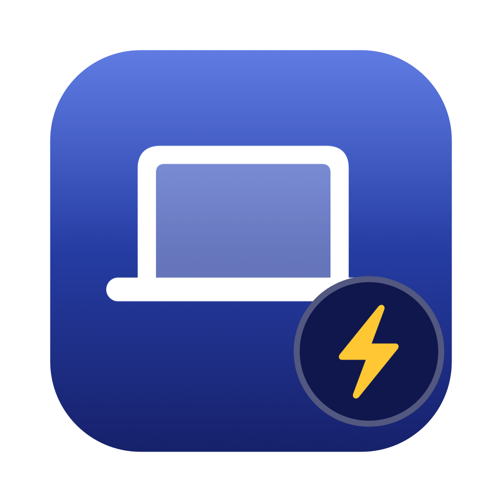

<div align="center">



# LidAwake

**合上盖子，让 Mac 继续跑。**

[English](README.en.md) · 简体中文

给需要长时间跑任务的人用的 macOS 原生菜单栏工具 —— AI Agent、编译、训练、下载、同步。
纯电池也有效，无需外接显示器或键鼠。

[](https://github.com/NeoSpecies/LidAwake/releases/latest)
[](https://www.apple.com/macos/)
[](https://swift.org)
[](LICENSE)
[](Package.swift)

</div>

---

## 这是为了解决什么问题

MacBook 一合盖就休眠：**SSH 断、API 连接断、正在跑的任务停在半路**。

在 AI Agent 时代这件事变得格外难受 —— Agent 正在跑一个 20 分钟的任务，你要合盖去开个会，
回来发现它停在第 3 分钟。

LidAwake 让你合盖之后机器继续保持唤醒和联网，任务照常跑完。

## 为什么不是 `caffeinate`，也不是 Amphetamine

网上流传的做法基本都解决不了合盖这个场景：

| 做法 | 合盖能续跑吗 | 原因 |
|---|---|---|
| `caffeinate -disu -t 3600` | ❌ **不能** | `-d/-i/-u` 建立的是 **idle**（空闲）断言。合盖属于 **forced sleep**，会直接绕过所有 idle 断言。这是最常见的误导 |
| `caffeinate -s` | ⚠️ 只有接通电源时 | `PreventSystemSleep` 只在 AC 供电下被系统尊重 |
| Amphetamine | ⚠️ 需要接电源 / 外接显示器 / 外接键鼠**之一** | 它是 App Store 沙盒应用，拿不到 root，只能用断言层 —— 这是它官方文档写明的能力边界 |
| **LidAwake** | ✅ **能，含纯电池** | 断言层 **+** 系统级 `SleepDisabled`（一次授权装特权服务） |

想覆盖"纯电池、没有任何外设、合盖"这一格，只有把系统级 `SleepDisabled` 置 1 这一条路，
而它需要 root。这就是 LidAwake 为什么要装一个后台服务，也是它比上述方案多出来的那部分能力。

## 实测证据

不靠"感觉挺好"，用 `mach_continuous_time() - mach_absolute_time()` 测 ——
**这个差值只在系统睡眠时增长**，所以"刚才睡了多久"是一个确定值。

| | 对照组（LidAwake 关闭） | 实验组（LidAwake 开启） |
|---|---|---|
| 环境 | 纯电池，无外设 | 纯电池，无外设 |
| 合盖时长 | 69 秒 | **138 秒** |
| **累计睡眠** | **61.52 秒** ❌ | **0.00 秒** ✅ |
| 最大采样间隔 | 62.03 秒（进程被冻结） | **0.51 秒**（＝采样周期，一次都没冻结） |
| 网卡 IPv4 | — | 325 个采样点**一次都没丢** ✅ |

机型：MacBook Pro (M5 Max) / macOS 26.5。完整数据见 [docs/RESULTS.md](docs/RESULTS.md)。

这套验证做成了工具，你可以在自己机器上复现：

```bash
lidawake on
lidawake-probe start        # 然后合盖 60 秒，再打开
lidawake-probe report --expect awake
```

## 特点

- **真的能纯电池合盖** —— 双层机制：`IOPMAssertion` 断言层 + 系统级 `SleepDisabled`
- **只授权一次** —— 装完之后所有开关操作都不再需要密码
- **有安全刹车** —— 电量过低、机身过热、超过时限都会自动放开，不会把电池干到 0%
- **不留常驻开销** —— 关闭且无客户端连接时守护进程会自己退出（0 个进程），需要时由 launchd 毫秒级拉起
- **零轮询** —— 电源/电量/温度走系统通知，UI 走 XPC 反向推送。实测激活 20 秒 CPU 累计 **0.04 秒**
- **能给脚本和 Agent 用** —— 完整 CLI，`--json` 输出可解析
- **失效安全** —— 崩溃被 launchd 接管并从磁盘恢复；卸载/关机/`bootout` 立刻放开，不会留下"永不休眠"的系统
- **能看见谁在偷电** —— `lidawake doctor` 会列出所有正在阻止休眠的第三方进程
- **零第三方依赖** —— 纯 Swift + AppKit + IOKit，不引入任何包

## 安装

### Homebrew（最快）

```bash
brew tap NeoSpecies/tap
brew install --cask lidawake
```

### 用安装包

从 [Releases](https://github.com/NeoSpecies/LidAwake/releases/latest) 下载 `.pkg`，然后：

```bash
sudo installer -pkg LidAwake-1.0.1.pkg -target /
```

> 目前的包**未做代码签名和公证**（作者暂无 Apple Developer ID）。
> 用上面的命令行安装不受 Gatekeeper 拦截；想双击图形安装的话需要**右键 →「打开」**。
> 详见 [docs/DISTRIBUTION.md](docs/DISTRIBUTION.md)。

### 从源码构建

只需要 Xcode Command Line Tools，**不需要完整 Xcode**：

```bash
git clone https://github.com/NeoSpecies/LidAwake.git
cd LidAwake
./scripts/install.sh          # 构建 + 跑测试 + 装 App + 一次授权装服务
```

其它命令：

```bash
./scripts/build.sh            # 只构建
./scripts/run-tests.sh        # 单元测试（85 项）
./scripts/make-pkg.sh         # 打安装包
./scripts/uninstall.sh        # 完整卸载（会复位 SleepDisabled）
```

## 使用

### 菜单栏

点击菜单栏图标：开启（无限期）／定时开启（15 分钟 ~ 8 小时／自定义）／关闭，
外加「安全策略」「诊断信息」「自检」「登录时启动」。

图标状态一眼可辨：`powersleep` 关闭 · `infinity.circle.fill` 无限期开启 ·
`timer` + 剩余时间 定时开启 · `exclamationmark.triangle` 受限模式。

### 命令行

```bash
lidawake on                       # 开启（无限期，受"单次最长时限"约束）
lidawake on --for 2h              # 定时 2 小时（支持 30s / 15m / 2h / 1h30m / 1d）
lidawake on --for 2h --origin ci  # 标注发起方，方便排查是谁开的
lidawake off                      # 关闭
lidawake status                   # 查看状态
lidawake status --json            # 机器可读
lidawake doctor                   # 诊断：机制是否完整、谁在阻止休眠
lidawake guards --battery-floor 30 --max 4h --require-ac on   # 调整安全策略
```

给 Agent / 构建脚本用：

```bash
lidawake on --for 2h --origin build.sh && make -j && lidawake off
```

退出码：`0` 成功 · `1` 用法错误 · `2` 服务不可用 · `3` 被安全策略拦下（可据此判断是不是电量不够）

## ⚠️ 注意事项（请务必读完）

### 1. 合盖之后电池照样在消耗

**这一点最重要**：LidAwake 只是阻止系统休眠，机器仍在全速运行 ——
CPU 在跑、Wi-Fi 在连、内存在刷新。合盖**不等于**省电。

- 合盖时屏幕本来就关掉了（这部分确实省），但整机功耗仍然显著
- 跑重负载（编译、模型推理）时电池掉得很快，几小时就能见底
- 因此默认策略是 **电量 ≤ 20%（电池供电时）自动关闭**，别把它关掉
- 长时间任务**建议接电源**

### 2. 合盖散热变差

盖子合上时键盘面的散热受影响。高负载 + 合盖 + 放在被子/沙发等软表面上尤其要注意。
默认开启 **机身过热（thermal critical）自动关闭**，同样建议别关。
另外默认**不**保持屏幕唤醒，这既省电也少发热。

### 3. 需要一次管理员授权，并且会装一个 root 守护进程

`SleepDisabled` 只能由 root 设置，绕不过去。装的东西全部列在这里，卸载脚本会全部清掉：

```
/Applications/LidAwake.app
/Library/PrivilegedHelperTools/lidawaked            (root:wheel 0755)
/Library/LaunchDaemons/com.cogito.lidawaked.plist   (root:wheel 0644)
/Library/Application Support/LidAwake/state.json    (root:wheel 0600)
/usr/local/bin/lidawake, /usr/local/bin/lidawake-probe
/var/log/lidawaked.log
```

守护进程只做一件事：开关系统休眠。它的 XPC 接口**只能表达 `off` / `indefinite` / `until(秒数)`**，
没有任何字段可以表达路径、命令或 shell 参数 —— 就算鉴权被绕过，能力上限也只是"让这台机器不睡觉"。
详见 [docs/REVIEW.md](docs/REVIEW.md) 的安全评审。

### 4. 别忘了关

开着不关的话，机器合盖后永远不睡。三道保险：
菜单栏图标会变成**实心高亮**、默认**单次最长 12 小时**、默认**电量 20% 自动关**。
`lidawake doctor` 随时能看到 `SleepDisabled` 的真实值。

### 5. 已知局限

- 当前使用 ad-hoc 签名，因此 XPC 只能校验"调用方是 root 或 admin 组成员"，
  没法校验调用方签名。拿到 Developer ID 后可收紧（[docs/DISTRIBUTION.md](docs/DISTRIBUTION.md) 有现成代码）
- 守护进程被 `kill -9` 且 launchd 无法拉起时（例如 plist 被手动删掉），
  `SleepDisabled` 会停在 1。缓解手段：开机时无条件复位、卸载时显式复位、`doctor` 直接显示该值
- 上不了 Mac App Store（沙盒规则冲突），原因和替代路线见 [docs/DISTRIBUTION.md](docs/DISTRIBUTION.md)

## 安全策略默认值

| 策略 | 默认 | 说明 |
|---|---|---|
| 电量下限 | 20% | **仅电池供电时判定**；接电时不触发 |
| 单次最长时限 | 12 小时 | 到点自动关闭 |
| 机身过热自动关闭 | 开 | 只在 `thermal critical` 时放开，`serious` 不动 |
| 仅接通电源时保持 | 关 | 打开后拔电即自动关闭 |
| 合盖时保持屏幕唤醒 | 关 | 打开会更费电更热 |
| 重启后恢复上次会话 | 关 | 失效安全默认 |

全部可在菜单「安全策略」或 `lidawake guards` 里改。

## 工作原理

```
LidAwake.app (菜单栏, LSUIElement)  ─┐
lidawake (CLI, 给脚本/Agent)        ─┼─ NSXPCConnection ──▶ lidawaked (root, launchd 托管)
                                                              ├─ IOPMAssertion 断言层（L1）
                                                              ├─ SleepDisabled 系统层（L2）
                                                              ├─ 电量/温度守卫（系统通知驱动）
                                                              └─ 纯函数决策引擎（85 项单测）
```

- **L1 断言层**：`PreventUserIdleSystemSleep` + `PreventSystemSleep`，无需 root，立即生效，
  `pmset -g assertions` 可见。守护进程缺失时作为降级路径（会明确告知用户局限）
- **L2 系统层**：`IOPMSetSystemPowerSetting("SleepDisabled", true)`（即 `pmset -a disablesleep 1`），
  需 root，**这是纯电池也能生效的原因**。通过 `dlsym` 动态解析，符号不可用时自动回退到 `pmset` 命令
- **决策引擎是纯函数**：不读时钟、不读 IOKit、不写文件，环境事实全部注入。
  这是"合盖是否休眠"这种没法在 CI 里复现的逻辑仍然能被 85 条单测锁住的原因
- **任何"已开启"状态都以系统回读结果为准**，不接受乐观假设

## 文档

| 文档 | 内容 |
|---|---|
| [docs/PRD.md](docs/PRD.md) | 产品规划、功能清单、性能预算 |
| [docs/SPEC.md](docs/SPEC.md) | 技术选型、架构、状态机、XPC 协议、失效安全矩阵 |
| [docs/TEST-PLAN.md](docs/TEST-PLAN.md) | 三层测试策略与完整测试矩阵 |
| [docs/REVIEW.md](docs/REVIEW.md) | 多轮评审发现的 13 个问题、改法、以及 3 条明确保留的残余风险 |
| [docs/RESULTS.md](docs/RESULTS.md) | 本机全部实测数据 |
| [docs/DISTRIBUTION.md](docs/DISTRIBUTION.md) | 签名/公证/上架：为什么上不了 App Store，以及三条可行路线 |

## 测试

| 层 | 内容 | 结果 |
|---|---|---|
| L1 单元测试 | 决策引擎优先级、边界等号、编解码、非法输入、鉴权策略、格式化 | ✅ 85/85 |
| L2 集成测试 | 真机施加/回读、幂等、定时自动关、`kill -9` 崩溃恢复、`bootout` 失效安全、守卫拦下、空闲自退、能耗 | ✅ 31/31 |
| L3 合盖 E2E | 对照组（应睡）+ 实验组（应不睡），mach 时钟差判定 | ✅ 双向 PASS |

```bash
./scripts/run-tests.sh                 # L1
sudo ./scripts/integration-test.sh     # L2
lidawake-probe start && lidawake-probe report --expect awake   # L3
```

CLT 环境下没有 `XCTest` / `swift-testing` 这两个 module，所以 L1 用的是自建的轻量 harness
（核心逻辑是纯函数，够用）。

## 卸载

```bash
./scripts/uninstall.sh
```

会退出 App、移除登录项、注销服务、**复位 `SleepDisabled`**、删除所有安装的文件。

## Roadmap

接下来最想做的三件事：

1. **`lidawake while -- <命令>`** —— 绑定进程生命周期，命令跑完自动关。
   不用再猜"这活儿要多久"，也不会忘记关
2. **合盖续航预估** —— 菜单栏直接显示「按当前功耗还能合盖跑 ≈ 2h10m」，
   并记录会话历史，让"合盖到底掉多少电"变成你自己机器上的真实数字
3. **英文 README + i18n + Homebrew Cask + CI** —— 让它更容易被别人用上

完整清单和「明确不做」的部分见 [ROADMAP.md](ROADMAP.md)。

## ⭐ 如果它帮到了你

LidAwake 解决的是一个很具体、也很烦人的问题：**合盖就断，任务白跑**。

如果它帮你救回过一次被打断的任务，点个 Star 是最实在的回报 ——
它能让下一个在搜「mac 合盖 不断网」的人更快找到这个答案，也让我知道值得继续做下去。

如果你觉得它还差点什么，[开个 Issue](https://github.com/NeoSpecies/LidAwake/issues)。
上面那份 Roadmap 的排序，很大程度上会由你们的反馈决定。

[](https://star-history.com/#NeoSpecies/LidAwake&Date)

## 关于作者

**Cogito**（[@NeoSpecies](https://github.com/NeoSpecies)）

**LidAwake 的起源**，用他自己的话说：

> 「Mac 合盖以后就直接断网并停止运行。但在 AI Agent 时代，这个事情非常非常难以接受。」

网上的教程要么给的是根本拦不住合盖的 `caffeinate -diu`，要么让你装个受能力边界限制的第三方 App。
于是他决定自己从 IOKit 层把这件事做对 —— 于是有了这个项目。

---

<div align="center">

### 👋 关注「顽皮的程序员」

**微信公众号** · **抖音** · **微信视频号**

三个平台同名，搜 **顽皮的程序员** 就能找到

聊 Mac 效率工具、AI Agent 实战、以及这类"自己动手把问题解决掉"的过程

<br>

[](https://www.neospecies.ai)
[](https://github.com/NeoSpecies)
[](mailto:neospecies@outlook.com)

</div>

---

## 参与贡献

欢迎 PR。几条约定：

```bash
./scripts/run-tests.sh                 # 必跑（85 项单元测试）
sudo ./scripts/integration-test.sh     # 改守护进程 / XPC / 决策引擎时必跑
```

- **改到机制层（断言层或 `SleepDisabled`）的 PR，请附一次合盖 E2E 报告**：
  `lidawake-probe start` → 合盖 60 秒 → `lidawake-probe report --expect awake`。
  这是本项目唯一能真正证明"改动没把核心能力弄坏"的手段
- 决策逻辑请继续放在 `Engine` 里保持纯函数（不读时钟、不读 IOKit、不写文件），
  并补上对应单测 —— 这是"合盖是否休眠"这种没法在 CI 里复现的逻辑仍然可测的前提
- **不要**扩大 XPC 协议的表达能力。它现在只能表达 `off` / `indefinite` / `until(秒数)`，
  没有任何字段能表达路径、命令或 shell 参数。这是本项目最重要的安全属性，
  别为了功能方便把它拆掉（背景见 [docs/REVIEW.md](docs/REVIEW.md) R2-1）
- 任何新增的"保持唤醒"能力，都必须同时想清楚它的**失效安全**：进程崩了怎么办、
  关机怎么办、用户忘了关怎么办

## License

[MIT](LICENSE)
